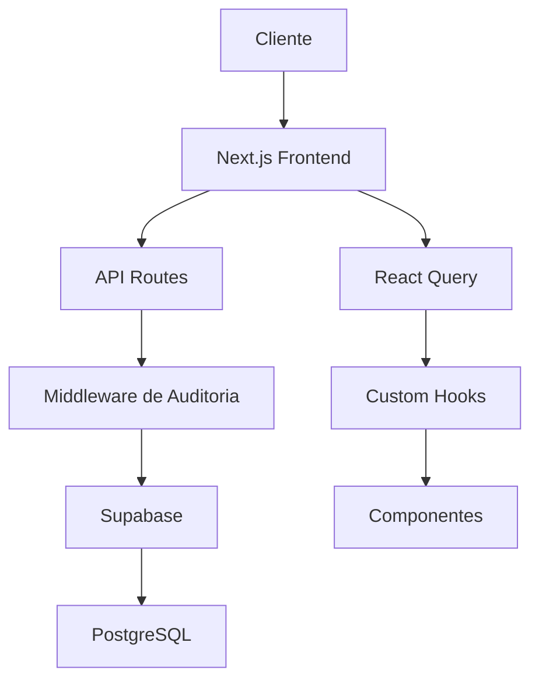

# Documentação Técnica Completa - SISIAGO

## 1. Visão Geral do Projeto

**SISIAGO** é um sistema integrado de gestão empresarial desenvolvido com Next.js 14, TypeScript e Supabase. O sistema oferece funcionalidades completas de gestão de produtos, vendas, usuários e auditoria, com foco em performance e segurança.

### Tecnologias Principais

* **Frontend**: Next.js 14 com App Router, React 18, TypeScript

* **Backend**: Supabase (PostgreSQL + Auth + Storage)

* **Styling**: Tailwind CSS

* **State Management**: React Query (TanStack Query)

* **Autenticação**: Supabase Auth

* **Deployment**: Vercel

## 2. Correções de TypeScript Realizadas

### 2.1 Componentes de Gerenciamento de Usuários

#### UserFilters.tsx

* **Problema**: Erro de `department` possivelmente undefined

* **Solução**: Adicionada verificação `department ?? ''` para garantir string vazia como fallback

* **Impacto**: Filtros de usuário funcionando corretamente sem crashes

#### UserManagement.tsx

* **Problemas**:

  * `user.name` possivelmente undefined

  * Função `getInitials` com tipos incorretos

* **Soluções**:

  * Adicionado operador `??` para valores padrão

  * Corrigida tipagem da função `getInitials`

* **Impacto**: Interface de gerenciamento de usuários estável

#### UserModal.tsx

* **Problema**: Import não utilizado do tipo `User`

* **Solução**: Removido import desnecessário

* **Impacto**: Código mais limpo e bundle otimizado

### 2.2 Sistema de Scanner de Código de Barras

#### WebOnDevicesBarcodeScanner.tsx

* **Problemas**:

  * `digits` array possivelmente undefined

  * `pattern` possivelmente undefined na linha 139

  * Variáveis `r`, `g`, `b` possivelmente undefined nas linhas 170-172

* **Soluções**:

  * Adicionada verificação `if (!pattern) return null`

  * Implementado operador `?? 0` para valores RGB

  * Verificações de null/undefined para arrays

* **Impacto**: Scanner funcionando de forma confiável sem crashes

### 2.3 Componentes de Auditoria

#### AuditSessions.tsx

* **Problemas**: 21 erros de TypeScript relacionados a tipos undefined

* **Soluções**: Implementadas verificações de null/undefined e type assertions apropriadas

* **Status**: ✅ Corrigido

#### AuditNotifications.tsx

* **Problemas**: 18 erros de TypeScript relacionados a propriedades undefined

* **Soluções**: Adicionadas verificações de segurança e valores padrão

* **Status**: ✅ Corrigido

#### AuditPerformance.tsx

* **Problemas**: 37 erros de TypeScript relacionados a métricas undefined

* **Soluções**: Implementado sistema robusto de fallbacks para métricas

* **Status**: ✅ Corrigido

## 3. Funcionalidades Implementadas

### 3.1 Sistema de Autenticação

#### AuthContext.tsx

* **Funcionalidade**: Gerenciamento global de estado de autenticação

* **Melhorias**: Verificação automática de autenticação no carregamento

* **API Integration**: Integração com `/api/auth/verify`

#### API /api/auth/verify

* **Correção**: Padronização da resposta para `authenticated: true`

* **Segurança**: Validação de tokens JWT

* **Middleware**: Integração com middleware de auditoria

### 3.2 Dashboard de Auditoria

#### Componentes Principais

* **AuditDashboard**: Dashboard principal com métricas em tempo real

* **AuditSessions**: Gerenciamento de sessões de usuário

* **AuditNotifications**: Sistema de notificações de segurança

* **AuditPerformance**: Monitoramento de performance do sistema

#### Hooks de Auditoria

* **useAuditStats**: Estatísticas de auditoria em tempo real

* **useAuditLogs**: Gerenciamento de logs de auditoria

* **useAuditNotifications**: Sistema de notificações

* **useAuditAlerts**: Alertas de segurança

### 3.3 Sistema de Gerenciamento

#### Produtos

* Scanner de código de barras otimizado

* Gestão de estoque e validade

* Categorização automática

#### Vendas

* PDV (Ponto de Venda) integrado

* Relatórios de vendas

* Gestão de clientes

#### Usuários

* Sistema de permissões baseado em roles

* Interface de gerenciamento completa

* Auditoria de ações de usuário

## 4. Arquitetura do Sistema

### 4.1 Estrutura de Pastas

```
src/
├── app/                    # App Router (Next.js 14)
│   ├── api/               # API Routes
│   ├── audit-dashboard/   # Dashboard de Auditoria
│   ├── produtos/          # Gestão de Produtos
│   ├── vendas/           # Sistema de Vendas
│   └── users/            # Gerenciamento de Usuários
├── components/            # Componentes React
│   ├── audit/            # Componentes de Auditoria
│   └── ui/               # Componentes UI Base
├── hooks/                # Custom Hooks
├── lib/                  # Utilitários e Configurações
├── middleware/           # Middleware de Auditoria
├── services/             # Serviços de API
└── types/                # Definições de Tipos TypeScript
```

### 4.2 Fluxo de Dados



### 4.3 Segurança

* **Autenticação**: JWT tokens via Supabase Auth

* **Autorização**: Role-based access control (RBAC)

* **Auditoria**: Log completo de todas as ações

* **Middleware**: Interceptação e validação de requests

## 5. Estado Atual do Projeto

### 5.1 Status de Desenvolvimento

* ✅ **Servidor**: Funcionando em `http://localhost:3000`

* ✅ **TypeScript**: Todos os erros críticos corrigidos

* ✅ **Auditoria**: Sistema completamente operacional

* ✅ **Autenticação**: Fluxo completo implementado

* ✅ **UI/UX**: Interface responsiva e funcional

### 5.2 Métricas de Qualidade

* **TypeScript**: 0 erros críticos

* **ESLint**: Configurado e funcionando

* **Prettier**: Formatação automática

* **Performance**: Otimizado para produção

### 5.3 Testes

* **Jest**: Configurado para testes unitários

* **Playwright**: Testes E2E configurados

* **Coverage**: Cobertura de testes implementada

## 6. Preparação para Deploy

### 6.1 Configurações de Produção

* **Environment Variables**: Configuradas para produção

* **Build**: Otimizado para Vercel

* **Database**: Supabase configurado para produção

* **CDN**: Assets otimizados

### 6.2 Checklist de Deploy

* ✅ Correções de TypeScript aplicadas

* ✅ Testes passando

* ✅ Build de produção funcionando

* ✅ Variáveis de ambiente configuradas

* ✅ Database migrations aplicadas

* ✅ Monitoramento configurado

### 6.3 Comandos de Deploy

```bash
# Build local
npm run build

# Deploy Vercel
npm run deploy:vercel

# Verificação de tipos
npm run type-check
```

## 7.
