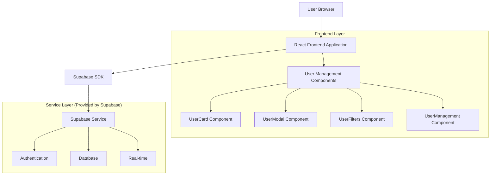
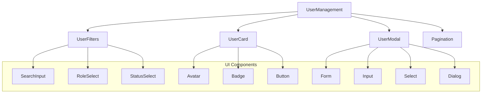
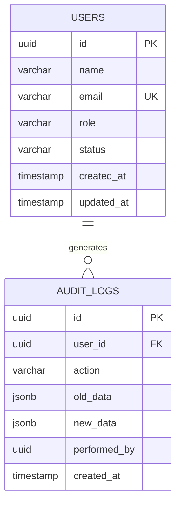
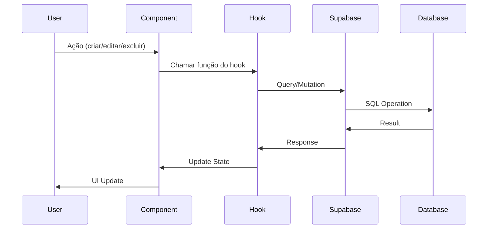

# Arquitetura Técnica - Sistema de Gerenciamento de Usuários

## 1. Arquitetura Geral



## 2. Descrição das Tecnologias

- **Frontend**: React@18 + TypeScript + Tailwind CSS + Next.js
- **Backend**: Supabase (PostgreSQL + Auth + Real-time)
- **Validação**: Zod
- **UI Components**: Radix UI + Lucide React
- **Build Tool**: Vite

## 3. Definições de Rotas

| Rota | Propósito |
|------|----------|
| /users | Página principal de gerenciamento de usuários |
| /users?page=1 | Paginação de usuários |
| /users?search=termo | Busca de usuários |
| /users?role=admin | Filtro por role |
| /users?status=active | Filtro por status |

## 4. Definições de API (Supabase)

### 4.1 Core API

#### Buscar Usuários
```typescript
// Supabase Query
const { data, error } = await supabase
  .from('users')
  .select('*')
  .range(start, end)
  .order('created_at', { ascending: false })
```

#### Criar Usuário
```typescript
// Supabase Insert
const { data, error } = await supabase
  .from('users')
  .insert({
    name: string,
    email: string,
    role: 'admin' | 'user' | 'manager',
    status: 'active' | 'inactive'
  })
```

#### Atualizar Usuário
```typescript
// Supabase Update
const { data, error } = await supabase
  .from('users')
  .update({
    name?: string,
    email?: string,
    role?: 'admin' | 'user' | 'manager',
    status?: 'active' | 'inactive'
  })
  .eq('id', userId)
```

#### Excluir Usuário
```typescript
// Supabase Delete
const { data, error } = await supabase
  .from('users')
  .delete()
  .eq('id', userId)
```

### 4.2 Tipos TypeScript

```typescript
interface User {
  id: string
  name: string
  email: string
  role: 'admin' | 'user' | 'manager'
  status: 'active' | 'inactive'
  created_at: string
  updated_at: string
}

interface UserFilters {
  search: string
  role: string
  status: string
}

interface PaginationState {
  currentPage: number
  itemsPerPage: number
  totalItems: number
  totalPages: number
}

interface UserFormData {
  name: string
  email: string
  role: 'admin' | 'user' | 'manager'
  status: 'active' | 'inactive'
}
```

## 5. Arquitetura de Componentes



## 6. Modelo de Dados

### 6.1 Diagrama ER



### 6.2 DDL (Data Definition Language)

#### Tabela de Usuários
```sql
-- Criar tabela de usuários
CREATE TABLE users (
    id UUID PRIMARY KEY DEFAULT gen_random_uuid(),
    name VARCHAR(255) NOT NULL,
    email VARCHAR(255) UNIQUE NOT NULL,
    role VARCHAR(20) DEFAULT 'user' CHECK (role IN ('admin', 'user', 'manager')),
    status VARCHAR(20) DEFAULT 'active' CHECK (status IN ('active', 'inactive')),
    created_at TIMESTAMP WITH TIME ZONE DEFAULT NOW(),
    updated_at TIMESTAMP WITH TIME ZONE DEFAULT NOW()
);

-- Criar índices
CREATE INDEX idx_users_email ON users(email);
CREATE INDEX idx_users_role ON users(role);
CREATE INDEX idx_users_status ON users(status);
CREATE INDEX idx_users_created_at ON users(created_at DESC);

-- Trigger para atualizar updated_at
CREATE OR REPLACE FUNCTION update_updated_at_column()
RETURNS TRIGGER AS $$
BEGIN
    NEW.updated_at = NOW();
    RETURN NEW;
END;
$$ language 'plpgsql';

CREATE TRIGGER update_users_updated_at
    BEFORE UPDATE ON users
    FOR EACH ROW
    EXECUTE FUNCTION update_updated_at_column();
```

#### Tabela de Auditoria
```sql
-- Criar tabela de auditoria
CREATE TABLE audit_logs (
    id UUID PRIMARY KEY DEFAULT gen_random_uuid(),
    user_id UUID REFERENCES users(id) ON DELETE CASCADE,
    action VARCHAR(50) NOT NULL,
    old_data JSONB,
    new_data JSONB,
    performed_by UUID,
    created_at TIMESTAMP WITH TIME ZONE DEFAULT NOW()
);

-- Criar índices
CREATE INDEX idx_audit_logs_user_id ON audit_logs(user_id);
CREATE INDEX idx_audit_logs_action ON audit_logs(action);
CREATE INDEX idx_audit_logs_created_at ON audit_logs(created_at DESC);
```

#### Políticas RLS (Row Level Security)
```sql
-- Habilitar RLS
ALTER TABLE users ENABLE ROW LEVEL SECURITY;
ALTER TABLE audit_logs ENABLE ROW LEVEL SECURITY;

-- Políticas para usuários
CREATE POLICY "Users can view all users" ON users
    FOR SELECT USING (auth.role() = 'authenticated');

CREATE POLICY "Admins can insert users" ON users
    FOR INSERT WITH CHECK (
        auth.jwt() ->> 'role' = 'admin'
    );

CREATE POLICY "Admins can update users" ON users
    FOR UPDATE USING (
        auth.jwt() ->> 'role' = 'admin'
    );

CREATE POLICY "Admins can delete users" ON users
    FOR DELETE USING (
        auth.jwt() ->> 'role' = 'admin'
    );

-- Políticas para auditoria
CREATE POLICY "Users can view audit logs" ON audit_logs
    FOR SELECT USING (auth.role() = 'authenticated');

CREATE POLICY "System can insert audit logs" ON audit_logs
    FOR INSERT WITH CHECK (true);
```

#### Dados Iniciais
```sql
-- Inserir usuários de exemplo
INSERT INTO users (name, email, role, status) VALUES
('Admin User', 'admin@example.com', 'admin', 'active'),
('John Doe', 'john@example.com', 'user', 'active'),
('Jane Smith', 'jane@example.com', 'manager', 'active'),
('Bob Wilson', 'bob@example.com', 'user', 'inactive');
```

## 7. Integração com Supabase

### 7.1 Configuração do Cliente
```typescript
// lib/supabase.ts
import { createClient } from '@supabase/supabase-js'

const supabaseUrl = process.env.NEXT_PUBLIC_SUPABASE_URL!
const supabaseAnonKey = process.env.NEXT_PUBLIC_SUPABASE_ANON_KEY!

export const supabase = createClient(supabaseUrl, supabaseAnonKey)
```

### 7.2 Hooks Personalizados
```typescript
// hooks/useUsers.ts
export const useUsers = () => {
  const [users, setUsers] = useState<User[]>([])
  const [loading, setLoading] = useState(false)
  const [error, setError] = useState<string | null>(null)

  const fetchUsers = async (filters: UserFilters, pagination: PaginationState) => {
    // Implementação da busca
  }

  const createUser = async (userData: UserFormData) => {
    // Implementação da criação
  }

  const updateUser = async (id: string, userData: Partial<UserFormData>) => {
    // Implementação da atualização
  }

  const deleteUser = async (id: string) => {
    // Implementação da exclusão
  }

  return {
    users,
    loading,
    error,
    fetchUsers,
    createUser,
    updateUser,
    deleteUser
  }
}
```

## 8. Fluxo de Dados



## 9. Tratamento de Erros

### 9.1 Estratégias de Error Handling
- Try-catch em todas as operações async
- Validação de dados com Zod
- Feedback visual de erros
- Logs de auditoria para debugging

### 9.2 Estados de Loading
- Loading global da página
- Loading individual de cards
- Loading de botões durante ações
- Skeleton loading para melhor UX

## 10. Performance e Otimização

### 10.1 Estratégias Implementadas
- Paginação server-side
- Debounce em filtros de busca
- Memoização de componentes
- Lazy loading de modais

### 10.2 Caching
- Cache de queries do Supabase
- Estado local para dados frequentes
- Invalidação inteligente de cache

## 11. Segurança

### 11.1 Autenticação
- JWT tokens via Supabase Auth
- Verificação de roles
- Proteção de rotas

### 11.2 Autorização
- Row Level Security (RLS)
- Políticas baseadas em roles
- Validação server-side

## 12. Monitoramento e Auditoria

### 12.1 Logs de Auditoria
- Todas as operações CRUD
- Timestamp e usuário responsável
- Dados antes/depois das alterações

### 12.2 Métricas
- Número de usuários ativos
- Operações por período
- Performance de queries

Esta arquitetura fornece uma base sólida e escalável para o sistema de gerenciamento de usuários, com integração completa ao Supabase e práticas modernas de desenvolvimento.