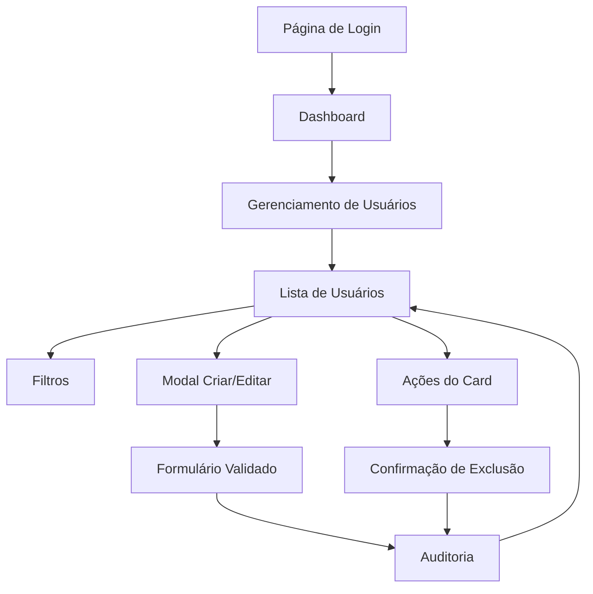

# Requisitos do Produto - Sistema de Gerenciamento de Usuários

## 1. Visão Geral do Produto

Sistema completo de gerenciamento de usuários com interface responsiva em cards, oferecendo funcionalidades CRUD, filtros avançados e auditoria de ações.

O sistema resolve a necessidade de administradores gerenciarem usuários de forma eficiente, com interface moderna e intuitiva. Destinado a administradores e gerentes que precisam controlar acesso e permissões de usuários.

O produto visa aumentar a produtividade da gestão de usuários em 70% através de uma interface otimizada e funcionalidades automatizadas.

## 2. Funcionalidades Principais

### 2.1 Papéis de Usuário

| Papel   | Método de Registro | Permissões Principais                                                  |
| ------- | ------------------ | ---------------------------------------------------------------------- |
| Admin   | Convite por email  | Acesso completo: criar, editar, excluir usuários, visualizar auditoria |
| Manager | Aprovação de admin | Pode editar usuários, visualizar relatórios, sem exclusão              |
| User    | Auto-registro      | Apenas visualizar próprio perfil, sem acesso ao gerenciamento          |

### 2.2 Módulo de Funcionalidades

Nossos requisitos de gerenciamento de usuários consistem nas seguintes páginas principais:

1. **Página de Gerenciamento**: listagem em cards, filtros avançados, paginação, ações CRUD
2. **Modal de Criação/Edição**: formulário validado, campos obrigatórios, feedback visual
3. **Sistema de Auditoria**: histórico de ações, logs detalhados, rastreabilidade

### 2.3 Detalhes das Páginas

| Nome da Página            | Nome do Módulo     | Descrição da Funcionalidade                                                                      |
| ------------------------- | ------------------ | ------------------------------------------------------------------------------------------------ |
| Gerenciamento de Usuários | Lista de Usuários  | Exibir usuários em cards responsivos com avatar, informações básicas, badges de status e role    |
| Gerenciamento de Usuários | Filtros Avançados  | Buscar por nome/email, filtrar por role (Admin/User/Manager), filtrar por status (Ativo/Inativo) |
| Gerenciamento de Usuários | Paginação          | Controlar itens por página (5/10/20), navegar entre páginas, mostrar total de registros          |
| Gerenciamento de Usuários | Ações CRUD         | Criar novo usuário, editar usuário existente, excluir com confirmação, ativar/desativar status   |
| Modal de Usuário          | Formulário         | Validar dados com Zod, campos obrigatórios (nome, email, role), feedback de erros em tempo real  |
| Modal de Usuário          | Estados de Loading | Mostrar spinners durante operações, desabilitar botões durante processamento                     |
| Sistema de Auditoria      | Logs de Ações      | Registrar todas operações CRUD, timestamp, usuário responsável, dados antes/depois               |
| Sistema de Auditoria      | Rastreabilidade    | Histórico completo de alterações, filtros por período, exportação de relatórios                  |

## 3. Processo Principal

**Fluxo do Administrador:**

1. Acessa página de gerenciamento de usuários
2. Visualiza lista de usuários em cards responsivos
3. Aplica filtros conforme necessário (busca, role, status)
4. Seleciona ação desejada (criar, editar, excluir)
5. Preenche formulário com validação em tempo real
6. Confirma operação e recebe feedback visual
7. Sistema registra ação na auditoria automaticamente

**Fluxo do Gerente:**

1. Acessa página de gerenciamento (sem opção de exclusão)
2. Visualiza e filtra usuários
3. Edita informações de usuários existentes
4. Visualiza relatórios de auditoria

## 4. Design da Interface do Usuário

### 4.1 Estilo de Design

* **Cores Primárias**: Azul (#3B82F6) para ações principais, Verde (#10B981) para status ativo

* **Cores Secundárias**: Cinza (#6B7280) para texto secundário, Vermelho (#EF4444) para exclusões

* **Estilo de Botões**: Arredondados (rounded-lg) com efeitos hover e estados de loading

* **Fonte**: Inter com tamanhos 14px (corpo), 16px (títulos), 12px (labels)

* **Layout**: Card-based com grid responsivo, navegação superior fixa

* **Ícones**: Lucide React com estilo minimalista e consistente

### 4.2 Visão Geral do Design das Páginas

| Nome da Página            | Nome do Módulo  | Elementos da UI                                                                                   |
| ------------------------- | --------------- | ------------------------------------------------------------------------------------------------- |
| Gerenciamento de Usuários | Header          | Título "Gerenciamento de Usuários", botão "Novo Usuário" (azul, rounded-lg), contador de usuários |
| Gerenciamento de Usuários | Filtros         | Barra de busca com ícone de lupa, selects para role e status, botão "Limpar Filtros"              |
| Gerenciamento de Usuários | Grid de Cards   | Layout responsivo (1-3 colunas), cards com sombra sutil, hover effects, avatars circulares        |
| Gerenciamento de Usuários | Card de Usuário | Avatar com iniciais, nome (font-medium), email (text-gray-500), badges coloridos para role/status |
| Gerenciamento de Usuários | Ações do Card   | Botões "Editar" (azul) e "Excluir" (vermelho), ícones Lucide, tooltips informativos               |
| Gerenciamento de Usuários | Paginação       | Controles de página, select de itens por página, indicadores numéricos                            |
| Modal de Usuário          | Overlay         | Fundo escuro semi-transparente, modal centralizado com animação de entrada                        |
| Modal de Usuário          | Formulário      | Inputs com labels flutuantes, validação visual (bordas vermelhas/verdes), mensagens de erro       |
| Modal de Usuário          | Botões de Ação  | "Cancelar" (cinza), "Salvar" (azul) com loading spinner, alinhamento à direita                    |

### 4.3 Responsividade

O produto é mobile-first com adaptação para desktop. Otimizado para interação touch em dispositivos móveis.

**Breakpoints:**

* Mobile: < 640px (1 coluna, filtros colapsáveis)

* Tablet: 640px - 1024px (2 colunas, filtros em linha)

* Desktop: > 1024px (3 colunas, layout completo)

**Otimizações Touch:**

* Botões com área mínima de 44px

* Espaçamento adequado entre elementos

* Gestos de swipe para navegação

* Modal responsivo com teclado virtual

