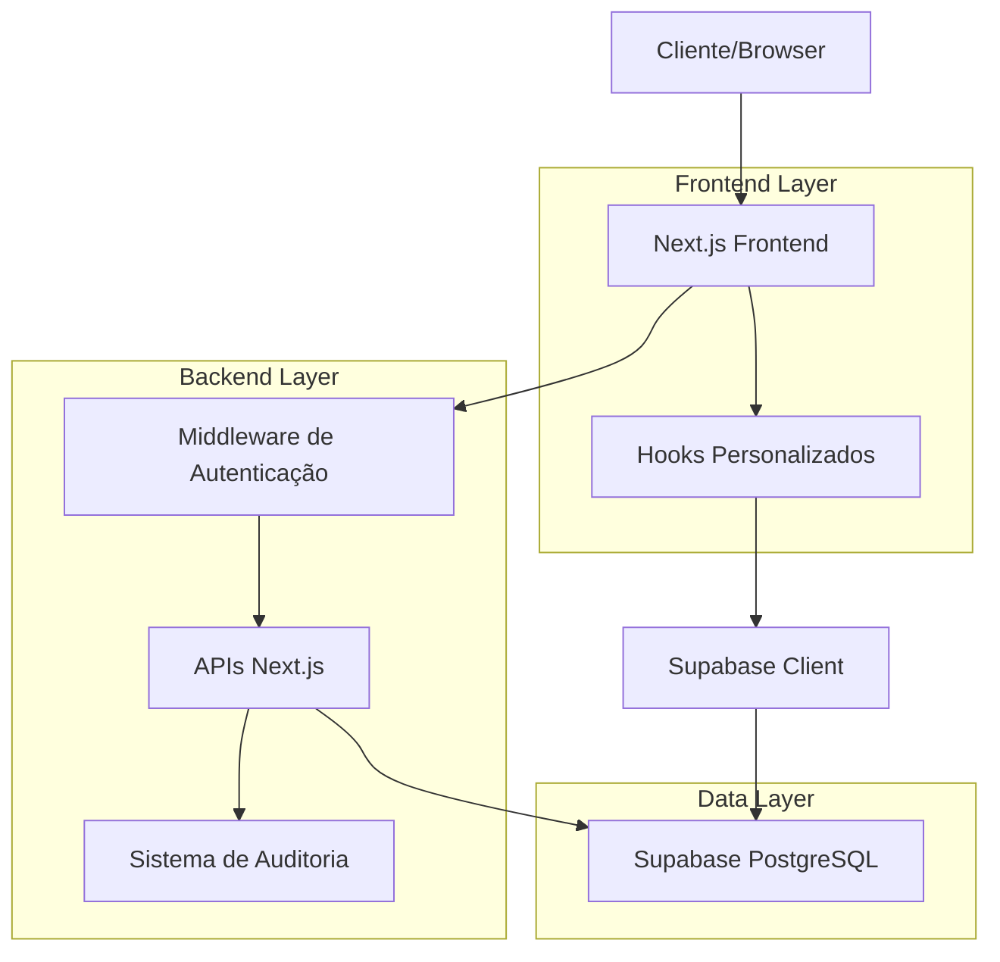
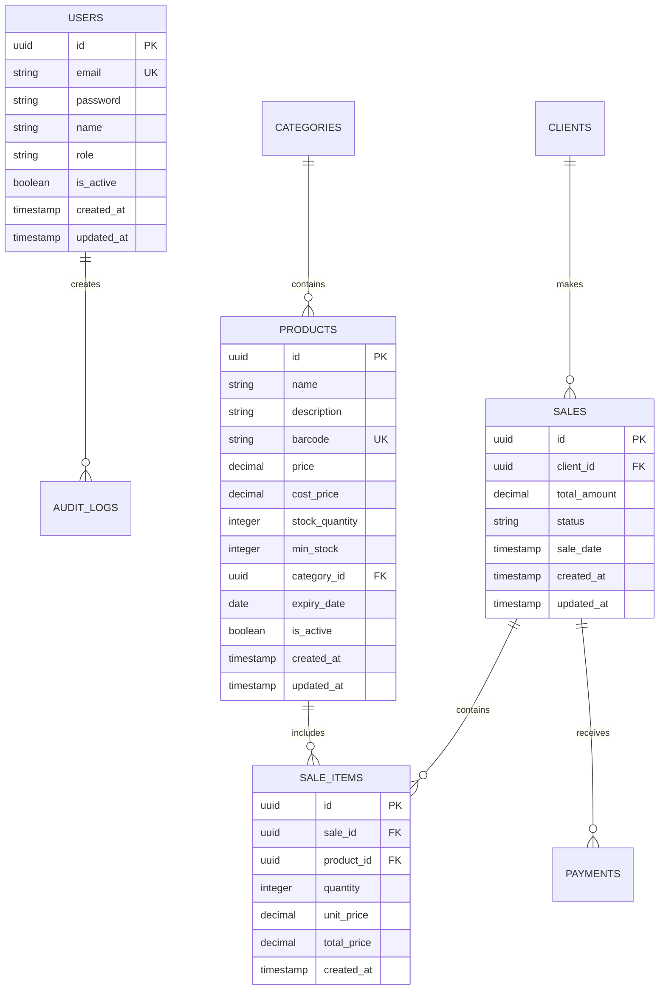
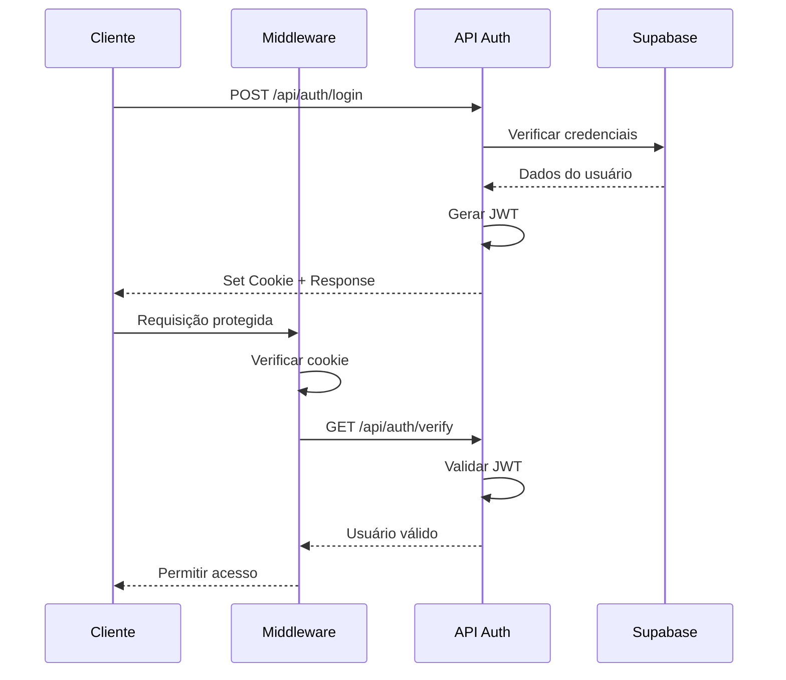
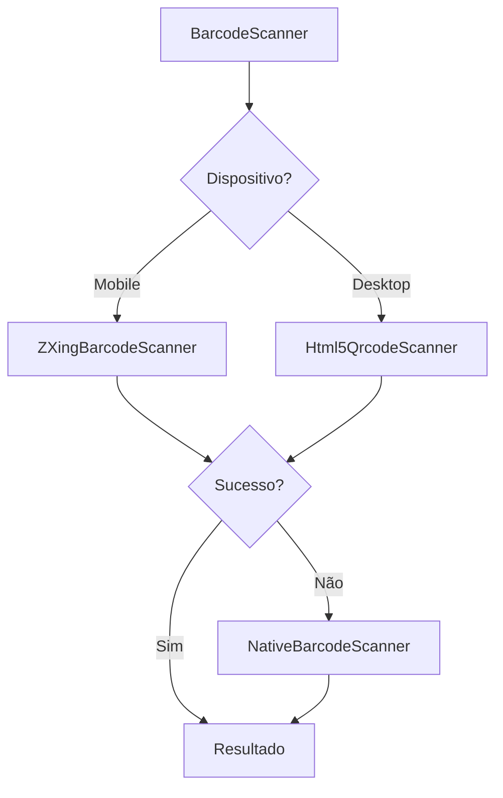
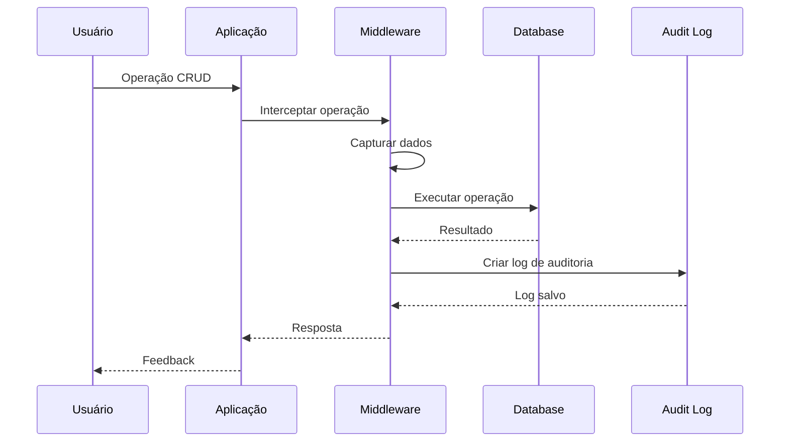

# SisIAGO - Sistema Integrado de Gestão

## 📋 Índice

1. [Visão Geral](#visão-geral)
2. [Arquitetura do Sistema](#arquitetura-do-sistema)
3. [Tecnologias Utilizadas](#tecnologias-utilizadas)
4. [Módulos do Sistema](#módulos-do-sistema)
5. [Estrutura do Banco de Dados](#estrutura-do-banco-de-dados)
6. [APIs Implementadas](#apis-implementadas)
7. [Componentes Principais](#componentes-principais)
8. [Hooks e Serviços](#hooks-e-serviços)
9. [Sistema de Autenticação](#sistema-de-autenticação)
10. [Integração com Supabase](#integração-com-supabase)
11. [Scanner de Código de Barras](#scanner-de-código-de-barras)
12. [Sistema de Auditoria](#sistema-de-auditoria)
13. [Configurações e Deployment](#configurações-e-deployment)

---

## 🎯 Visão Geral

O **SisIAGO** é um sistema integrado de gestão empresarial desenvolvido com tecnologias modernas, focado em oferecer uma solução completa para gerenciamento de vendas, estoque, clientes e operações comerciais. O sistema foi projetado com arquitetura escalável, interface responsiva e integração robusta com banco de dados.

### Principais Características

- **Interface Moderna**: Design responsivo com Tailwind CSS
- **Tempo Real**: Atualizações em tempo real com Supabase
- **Scanner Integrado**: Múltiplas tecnologias de leitura de código de barras
- **Auditoria Completa**: Rastreamento de todas as operações
- **Autenticação Segura**: Sistema JWT com middleware de proteção
- **PWA Ready**: Configurado para Progressive Web App

---

## 🏗️ Arquitetura do Sistema



### Camadas da Arquitetura

| Camada | Tecnologia | Responsabilidade |
|--------|------------|------------------|
| **Frontend** | Next.js 14 + React | Interface do usuário, componentes, hooks |
| **Middleware** | Next.js Middleware | Autenticação, proteção de rotas |
| **API** | Next.js API Routes | Endpoints REST, lógica de negócio |
| **Database** | Supabase PostgreSQL | Persistência de dados, RLS |
| **Auth** | JWT + Supabase Auth | Autenticação e autorização |

---

## 🛠️ Tecnologias Utilizadas

### Frontend
- **Next.js 14**: Framework React com App Router
- **React 18**: Biblioteca de interface de usuário
- **TypeScript**: Tipagem estática
- **Tailwind CSS**: Framework de estilização
- **Shadcn/ui**: Biblioteca de componentes
- **Lucide React**: Ícones
- **React Hook Form**: Gerenciamento de formulários
- **Zod**: Validação de esquemas
- **Sonner**: Notificações toast

### Backend & Database
- **Supabase**: Backend-as-a-Service
- **PostgreSQL**: Banco de dados relacional
- **Row Level Security**: Segurança a nível de linha
- **JWT**: Autenticação baseada em tokens

### Scanner & Mídia
- **ZXing**: Biblioteca de leitura de código de barras
- **Html5-QRCode**: Scanner QR Code HTML5
- **QuaggaJS**: Scanner de código de barras JavaScript
- **Canvas API**: Processamento de imagem nativo

### Desenvolvimento & Deploy
- **ESLint**: Linting de código
- **Prettier**: Formatação de código
- **Husky**: Git hooks
- **Jest**: Testes unitários
- **Playwright**: Testes E2E
- **Docker**: Containerização
- **Vercel**: Deploy e hosting

---

## 📦 Módulos do Sistema

### 1. 📊 Dashboard

**Localização**: `src/app/page.tsx`

**Funcionalidades**:
- Visão geral das métricas principais
- Gráficos de vendas e estatísticas
- Alertas de produtos vencidos
- Resumo financeiro
- Indicadores de performance

**Componentes**:
- `DashboardStats`: Estatísticas principais
- `SimpleChart`: Gráficos simples
- `ExpiredProductsAlert`: Alertas de vencimento

### 2. 📦 Gestão de Produtos

**Localização**: `src/app/produtos/`

**Funcionalidades**:
- CRUD completo de produtos
- Controle de estoque
- Gestão de preços
- Categorização
- Scanner de código de barras
- Controle de validade
- Filtros avançados

**APIs**:
- `GET /api/products` - Listar produtos
- `POST /api/products` - Criar produto
- `PUT /api/products/[id]` - Atualizar produto
- `DELETE /api/products/[id]` - Excluir produto

### 3. 🛒 Sistema de Vendas

**Localização**: `src/app/vendas/`

**Funcionalidades**:
- Registro de vendas
- Gestão de itens de venda
- Cálculo automático de totais
- Histórico de vendas
- Relatórios de vendas
- Filtros por período

**Estrutura**:
```typescript
interface Sale {
  id: string
  client_id?: string
  total_amount: number
  status: 'PENDING' | 'COMPLETED' | 'CANCELLED'
  sale_date: Date
  items: SaleItem[]
}
```

### 4. 👥 Gestão de Clientes

**Localização**: `src/app/clientes/`

**Funcionalidades**:
- Cadastro de clientes
- Histórico de compras
- Dados de contato
- Segmentação de clientes
- Relatórios de clientes

### 5. 🏷️ Gestão de Categorias

**Localização**: `src/app/categorias/`

**Funcionalidades**:
- CRUD de categorias
- Organização hierárquica
- Associação com produtos
- Filtros por categoria

### 6. 💳 Sistema de Pagamentos

**Localização**: `src/app/pagamentos/`

**Funcionalidades**:
- Registro de pagamentos
- Múltiplas formas de pagamento
- Controle de recebimentos
- Integração PIX
- Relatórios financeiros

### 7. 👤 Gerenciamento de Usuários

**Localização**: `src/app/users/`

**Funcionalidades**:
- ✅ CRUD completo de usuários
- ✅ Sistema de roles (ADMIN, MANAGER, OPERATOR)
- ✅ Controle de status (ativo/inativo)
- ✅ Filtros avançados (nome, email, role, status)
- ✅ Paginação server-side
- ✅ Validação com Zod
- ✅ Interface em cards responsiva
- ✅ Modais para criação/edição
- ✅ Confirmação de exclusão
- ✅ Integração com auditoria
- ✅ Estados de loading
- ✅ Feedback visual com toast

**Componentes**:
- `UserCard`: Card individual de usuário
- `UserModal`: Modal para criação/edição
- `UserFilters`: Sistema de filtros
- `UserManagement`: Componente principal

**Hooks**:
- `useUsers`: Operações CRUD
- `useUserStats`: Estatísticas de usuários

### 8. 🛍️ PDV (Ponto de Venda)

**Localização**: `src/app/pdv/`

**Funcionalidades**:
- Interface de venda rápida
- Scanner integrado
- Cálculo automático
- Múltiplas formas de pagamento
- Impressão de cupons
- Gestão de caixa

**Store**: `src/stores/pdvStore.ts`
- Estado global do PDV
- Carrinho de compras
- Cálculos de totais

### 9. 📈 Relatórios

**Localização**: `src/app/relatorios/`

**Funcionalidades**:
- Relatórios de vendas
- Relatórios de estoque
- Relatórios financeiros
- Exportação de dados
- Gráficos e dashboards

### 10. 🔍 Sistema de Auditoria

**Localização**: `src/app/audit-logs/`

**Funcionalidades**:
- ✅ Rastreamento de todas as operações
- ✅ Log de alterações (antes/depois)
- ✅ Identificação de usuário
- ✅ Timestamp de operações
- ✅ Filtros por tabela/ação/usuário
- ✅ Interface de consulta

### 11. ⚙️ Configurações

**Localização**: `src/app/configuracoes/`

**Funcionalidades**:
- Configurações do sistema
- Parâmetros de negócio
- Configurações de impressão
- Backup e restore

---

## 🗄️ Estrutura do Banco de Dados

### Tabelas Principais

#### Users (Usuários)
```sql
CREATE TABLE users (
    id UUID PRIMARY KEY DEFAULT gen_random_uuid(),
    email VARCHAR(255) UNIQUE NOT NULL,
    password VARCHAR(255) NOT NULL,
    name VARCHAR(255),
    role VARCHAR(20) DEFAULT 'OPERATOR' CHECK (role IN ('ADMIN', 'MANAGER', 'OPERATOR')),
    is_active BOOLEAN DEFAULT true,
    created_at TIMESTAMP WITH TIME ZONE DEFAULT NOW(),
    updated_at TIMESTAMP WITH TIME ZONE DEFAULT NOW()
);
```

#### Products (Produtos)
```sql
CREATE TABLE products (
    id UUID PRIMARY KEY DEFAULT gen_random_uuid(),
    name VARCHAR(255) NOT NULL,
    description TEXT,
    barcode VARCHAR(100) UNIQUE,
    price DECIMAL(10,2) NOT NULL,
    cost_price DECIMAL(10,2),
    stock_quantity INTEGER DEFAULT 0,
    min_stock INTEGER DEFAULT 0,
    category_id UUID REFERENCES categories(id),
    expiry_date DATE,
    is_active BOOLEAN DEFAULT true,
    created_at TIMESTAMP WITH TIME ZONE DEFAULT NOW(),
    updated_at TIMESTAMP WITH TIME ZONE DEFAULT NOW()
);
```

#### Sales (Vendas)
```sql
CREATE TABLE sales (
    id UUID PRIMARY KEY DEFAULT gen_random_uuid(),
    client_id UUID REFERENCES clients(id),
    total_amount DECIMAL(10,2) NOT NULL,
    status VARCHAR(20) DEFAULT 'PENDING' CHECK (status IN ('PENDING', 'COMPLETED', 'CANCELLED')),
    sale_date TIMESTAMP WITH TIME ZONE DEFAULT NOW(),
    created_at TIMESTAMP WITH TIME ZONE DEFAULT NOW(),
    updated_at TIMESTAMP WITH TIME ZONE DEFAULT NOW()
);
```

#### Sale Items (Itens de Venda)
```sql
CREATE TABLE sale_items (
    id UUID PRIMARY KEY DEFAULT gen_random_uuid(),
    sale_id UUID REFERENCES sales(id) ON DELETE CASCADE,
    product_id UUID REFERENCES products(id),
    quantity INTEGER NOT NULL,
    unit_price DECIMAL(10,2) NOT NULL,
    total_price DECIMAL(10,2) NOT NULL,
    created_at TIMESTAMP WITH TIME ZONE DEFAULT NOW()
);
```

#### Clients (Clientes)
```sql
CREATE TABLE clients (
    id UUID PRIMARY KEY DEFAULT gen_random_uuid(),
    name VARCHAR(255) NOT NULL,
    email VARCHAR(255),
    phone VARCHAR(20),
    address TEXT,
    document VARCHAR(20),
    is_active BOOLEAN DEFAULT true,
    created_at TIMESTAMP WITH TIME ZONE DEFAULT NOW(),
    updated_at TIMESTAMP WITH TIME ZONE DEFAULT NOW()
);
```

#### Categories (Categorias)
```sql
CREATE TABLE categories (
    id UUID PRIMARY KEY DEFAULT gen_random_uuid(),
    name VARCHAR(255) NOT NULL,
    description TEXT,
    is_active BOOLEAN DEFAULT true,
    created_at TIMESTAMP WITH TIME ZONE DEFAULT NOW(),
    updated_at TIMESTAMP WITH TIME ZONE DEFAULT NOW()
);
```

#### Payments (Pagamentos)
```sql
CREATE TABLE payments (
    id UUID PRIMARY KEY DEFAULT gen_random_uuid(),
    sale_id UUID REFERENCES sales(id),
    amount DECIMAL(10,2) NOT NULL,
    payment_method VARCHAR(50) NOT NULL,
    payment_date TIMESTAMP WITH TIME ZONE DEFAULT NOW(),
    status VARCHAR(20) DEFAULT 'PENDING' CHECK (status IN ('PENDING', 'COMPLETED', 'FAILED')),
    created_at TIMESTAMP WITH TIME ZONE DEFAULT NOW()
);
```

#### Audit Logs (Logs de Auditoria)
```sql
CREATE TABLE audit_logs (
    id UUID PRIMARY KEY DEFAULT gen_random_uuid(),
    table_name VARCHAR(100) NOT NULL,
    record_id VARCHAR(100) NOT NULL,
    action VARCHAR(20) NOT NULL CHECK (action IN ('CREATE', 'UPDATE', 'DELETE')),
    old_values JSONB,
    new_values JSONB,
    user_id VARCHAR(100),
    timestamp TIMESTAMP WITH TIME ZONE DEFAULT NOW()
);
```

### Relacionamentos



---

## 🔌 APIs Implementadas

### Autenticação

#### POST /api/auth/login
**Descrição**: Autenticação de usuário

**Request**:
```json
{
  "email": "admin@sisiago.com",
  "password": "123456"
}
```

**Response**:
```json
{
  "success": true,
  "user": {
    "id": "uuid",
    "email": "admin@sisiago.com",
    "name": "Administrador",
    "role": "ADMIN"
  }
}
```

#### GET /api/auth/verify
**Descrição**: Verificação de token JWT

**Headers**:
```
Cookie: auth-token=jwt_token_here
```

**Response**:
```json
{
  "valid": true,
  "user": {
    "id": "uuid",
    "email": "admin@sisiago.com",
    "role": "ADMIN"
  }
}
```

#### POST /api/auth/logout
**Descrição**: Logout do usuário

**Response**:
```json
{
  "success": true,
  "message": "Logout realizado com sucesso"
}
```

### Produtos

#### GET /api/products
**Descrição**: Listar produtos com filtros

**Query Parameters**:
- `search`: Busca por nome ou código de barras
- `category`: Filtro por categoria
- `page`: Página (padrão: 1)
- `limit`: Itens por página (padrão: 10)

#### POST /api/products
**Descrição**: Criar novo produto

**Request**:
```json
{
  "name": "Produto Teste",
  "description": "Descrição do produto",
  "barcode": "1234567890123",
  "price": 29.90,
  "cost_price": 15.00,
  "stock_quantity": 100,
  "category_id": "uuid"
}
```

### Vendas

#### GET /api/sales
**Descrição**: Listar vendas

#### POST /api/sales
**Descrição**: Criar nova venda

**Request**:
```json
{
  "client_id": "uuid",
  "items": [
    {
      "product_id": "uuid",
      "quantity": 2,
      "unit_price": 29.90
    }
  ],
  "payments": [
    {
      "amount": 59.80,
      "payment_method": "CASH"
    }
  ]
}
```

### Dashboard

#### GET /api/dashboard/stats
**Descrição**: Estatísticas do dashboard

**Response**:
```json
{
  "sales": {
    "today": 1500.00,
    "month": 45000.00,
    "growth": 12.5
  },
  "products": {
    "total": 1250,
    "low_stock": 15,
    "expired": 3
  },
  "clients": {
    "total": 450,
    "new_this_month": 25
  }
}
```

---

## 🧩 Componentes Principais

### Layout e Navegação

#### `src/app/layout.tsx`
- Layout principal da aplicação
- Configuração de metadados
- Providers globais
- Estrutura HTML base

#### `src/components/ui/`
- Biblioteca de componentes base (Shadcn/ui)
- Componentes reutilizáveis
- Estilização consistente

### Componentes de Negócio

#### `DashboardStats`
**Localização**: `src/components/DashboardStats.tsx`

**Funcionalidades**:
- Exibição de métricas principais
- Cards de estatísticas
- Indicadores visuais
- Atualização em tempo real

#### `BarcodeScanner`
**Localização**: `src/components/BarcodeScanner.tsx`

**Funcionalidades**:
- Interface unificada para múltiplos scanners
- Fallback automático entre tecnologias
- Configuração de câmera
- Feedback visual

#### `UserManagement`
**Localização**: `src/components/UserManagement.tsx`

**Funcionalidades**:
- Interface completa de gerenciamento
- Filtros e busca
- Operações CRUD
- Paginação
- Estados de loading

### Componentes de Scanner

#### `ZXingBarcodeScanner`
**Localização**: `src/components/ZXingBarcodeScanner.tsx`

**Características**:
- Baseado na biblioteca ZXing
- Suporte a múltiplos formatos
- Configuração de câmera
- Processamento em tempo real

#### `Html5QrcodeScanner`
**Localização**: `src/components/Html5QrcodeScanner.tsx`

**Características**:
- Scanner HTML5 nativo
- QR Code e código de barras
- Interface responsiva
- Configurações avançadas

#### `NativeBarcodeScanner`
**Localização**: `src/components/NativeBarcodeScanner.tsx`

**Características**:
- Implementação nativa com Canvas API
- Algoritmos de detecção customizados
- Processamento de imagem
- Otimização de performance

---

## 🎣 Hooks e Serviços

### Hooks Personalizados

#### `useUsers`
**Localização**: `src/hooks/useUsers.ts`

**Funcionalidades**:
- ✅ CRUD completo de usuários
- ✅ Filtros e paginação
- ✅ Integração com Supabase
- ✅ Estados de loading/error
- ✅ Validação de dados
- ✅ Auditoria automática

**Métodos**:
```typescript
const {
  users,
  loading,
  error,
  total,
  fetchUsers,
  createUser,
  updateUser,
  deleteUser,
  getUserById
} = useUsers()
```

#### `useUserStats`
**Localização**: `src/hooks/useUsers.ts`

**Funcionalidades**:
- ✅ Estatísticas de usuários
- ✅ Contadores por role
- ✅ Status ativo/inativo
- ✅ Atualização em tempo real

#### `useProducts`
**Localização**: `src/hooks/useProducts.ts`

**Funcionalidades**:
- CRUD de produtos
- Controle de estoque
- Filtros avançados
- Busca por código de barras

#### `useDashboardStats`
**Localização**: `src/hooks/useDashboardStats.ts`

**Funcionalidades**:
- Estatísticas do dashboard
- Métricas de vendas
- Indicadores de performance
- Cache de dados

#### `useExpiredProducts`
**Localização**: `src/hooks/useExpiredProducts.ts`

**Funcionalidades**:
- Produtos próximos ao vencimento
- Alertas automáticos
- Configuração de dias de antecedência

### Serviços

#### `apiService`
**Localização**: `src/services/apiService.ts`

**Funcionalidades**:
- Cliente HTTP configurado
- Interceptors de request/response
- Tratamento de erros
- Autenticação automática

#### `productsService`
**Localização**: `src/services/productsService.ts`

**Funcionalidades**:
- Operações específicas de produtos
- Validações de negócio
- Integração com scanner
- Cache de produtos

### Stores (Zustand)

#### `pdvStore`
**Localização**: `src/stores/pdvStore.ts`

**Estado**:
```typescript
interface PDVState {
  cart: CartItem[]
  client: Client | null
  total: number
  addItem: (product: Product, quantity: number) => void
  removeItem: (productId: string) => void
  updateQuantity: (productId: string, quantity: number) => void
  setClient: (client: Client) => void
  clearCart: () => void
  calculateTotal: () => number
}
```

---

## 🔐 Sistema de Autenticação

### Arquitetura de Autenticação



### Middleware de Autenticação

**Localização**: `src/middleware.ts`

**Funcionalidades**:
- ✅ Proteção de rotas
- ✅ Verificação de JWT
- ✅ Redirecionamento automático
- ✅ Whitelist de rotas públicas

**Configuração**:
```typescript
export const config = {
  matcher: [
    '/((?!api/auth/login|api/auth/verify|login|_next/static|_next/image|favicon.ico).*)',
  ],
}
```

### Context de Autenticação

**Localização**: `src/contexts/AuthContext.tsx`

**Funcionalidades**:
- Estado global do usuário
- Funções de login/logout
- Verificação de permissões
- Persistência de sessão

**Interface**:
```typescript
interface AuthContextType {
  user: User | null
  loading: boolean
  login: (email: string, password: string) => Promise<boolean>
  logout: () => Promise<void>
  checkAuth: () => Promise<void>
  hasPermission: (permission: string) => boolean
}
```

### Proteção de Componentes

#### `ProtectedRoute`
**Localização**: `src/components/ProtectedRoute.tsx`

**Uso**:
```tsx
<ProtectedRoute requiredRole="ADMIN">
  <AdminPanel />
</ProtectedRoute>
```

#### `PermissionGuard`
**Localização**: `src/components/PermissionGuard.tsx`

**Uso**:
```tsx
<PermissionGuard permission="users.create">
  <CreateUserButton />
</PermissionGuard>
```

### Sistema de Roles

| Role | Permissões | Descrição |
|------|------------|----------|
| **ADMIN** | Todas | Acesso completo ao sistema |
| **MANAGER** | Vendas, Produtos, Clientes, Relatórios | Gestão operacional |
| **OPERATOR** | PDV, Vendas básicas | Operação de caixa |

---

## 🔗 Integração com Supabase

### Configuração do Cliente

**Localização**: `src/lib/supabase.ts`

**Configuração**:
```typescript
import { createClient } from '@supabase/supabase-js'

const supabaseUrl = process.env.NEXT_PUBLIC_SUPABASE_URL!
const supabaseAnonKey = process.env.NEXT_PUBLIC_SUPABASE_ANON_KEY!

export const supabase = createClient(supabaseUrl, supabaseAnonKey)
```

### Tipos TypeScript

**Interfaces principais**:
```typescript
export interface User {
  id: string
  email: string
  name?: string
  role: 'ADMIN' | 'MANAGER' | 'OPERATOR'
  is_active: boolean
  created_at: string
  updated_at: string
}

export interface Product {
  id: string
  name: string
  description?: string
  barcode?: string
  price: number
  cost_price?: number
  stock_quantity: number
  min_stock: number
  category_id?: string
  expiry_date?: string
  is_active: boolean
  created_at: string
  updated_at: string
}
```

### Helpers de Database

**Funcionalidades**:
```typescript
export const db = {
  users: {
    getAll: () => supabase.from('users').select('*'),
    getById: (id: string) => supabase.from('users').select('*').eq('id', id).single(),
    create: (data: Partial<User>) => supabase.from('users').insert(data).select().single(),
    update: (id: string, data: Partial<User>) => supabase.from('users').update(data).eq('id', id).select().single(),
    delete: (id: string) => supabase.from('users').delete().eq('id', id)
  },
  // ... outros helpers
}
```

### Row Level Security (RLS)

**Políticas implementadas**:

```sql
-- Usuários autenticados podem ler todos os usuários
CREATE POLICY "Users can read all users" ON users
  FOR SELECT TO authenticated USING (true);

-- Apenas admins podem criar/editar/excluir usuários
CREATE POLICY "Only admins can modify users" ON users
  FOR ALL TO authenticated
  USING (auth.jwt() ->> 'role' = 'ADMIN');

-- Usuários podem ler produtos ativos
CREATE POLICY "Users can read active products" ON products
  FOR SELECT TO authenticated
  USING (is_active = true);
```

### Realtime Subscriptions

**Exemplo de uso**:
```typescript
const subscription = supabase
  .channel('products-changes')
  .on('postgres_changes', {
    event: '*',
    schema: 'public',
    table: 'products'
  }, (payload) => {
    console.log('Produto alterado:', payload)
    // Atualizar estado local
  })
  .subscribe()
```

---

## 📱 Scanner de Código de Barras

### Arquitetura Multi-Scanner

O sistema implementa múltiplas tecnologias de scanner com fallback automático:



### Componentes de Scanner

#### 1. BarcodeScanner (Principal)
**Localização**: `src/components/BarcodeScanner.tsx`

**Funcionalidades**:
- Detecção automática de dispositivo
- Fallback entre tecnologias
- Interface unificada
- Configuração de câmera

#### 2. ZXingBarcodeScanner
**Localização**: `src/components/ZXingBarcodeScanner.tsx`

**Características**:
- Biblioteca ZXing-js
- Suporte a EAN-13, EAN-8, Code 128
- Otimizado para mobile
- Processamento em tempo real

**Configuração**:
```typescript
const codeReader = new BrowserMultiFormatReader()
const hints = new Map()
hints.set(DecodeHintType.POSSIBLE_FORMATS, [
  BarcodeFormat.EAN_13,
  BarcodeFormat.EAN_8,
  BarcodeFormat.CODE_128
])
```

#### 3. Html5QrcodeScanner
**Localização**: `src/components/Html5QrcodeScanner.tsx`

**Características**:
- Biblioteca Html5-QRCode
- Interface HTML5 nativa
- Suporte a QR Code e código de barras
- Configurações avançadas

**Configuração**:
```typescript
const config = {
  fps: 10,
  qrbox: { width: 250, height: 250 },
  aspectRatio: 1.0,
  disableFlip: false,
  supportedScanTypes: [
    Html5QrcodeScanType.SCAN_TYPE_CAMERA
  ]
}
```

#### 4. NativeBarcodeScanner
**Localização**: `src/components/NativeBarcodeScanner.tsx`

**Características**:
- ✅ Implementação nativa com Canvas API
- ✅ Algoritmos de detecção customizados
- ✅ Processamento de imagem otimizado
- ✅ Suporte a EAN-13 e EAN-8
- ✅ Threshold adaptativo
- ✅ Filtros de qualidade de imagem

**Algoritmos implementados**:
- Conversão para escala de cinza
- Threshold adaptativo (método Otsu)
- Detecção de barras e espaços
- Decodificação EAN-13/EAN-8
- Validação de checksum

### Formatos Suportados

| Formato | ZXing | Html5QRCode | Native | Uso Principal |
|---------|-------|-------------|--------|---------------|
| **EAN-13** | ✅ | ✅ | ✅ | Produtos comerciais |
| **EAN-8** | ✅ | ✅ | ✅ | Produtos pequenos |
| **Code 128** | ✅ | ✅ | ❌ | Códigos internos |
| **QR Code** | ✅ | ✅ | ❌ | Links e dados |
| **Code 39** | ✅ | ✅ | ❌ | Códigos industriais |

### Integração com Produtos

**Fluxo de uso**:
1. Scanner detecta código
2. Busca produto no banco de dados
3. Se encontrado, adiciona ao carrinho/formulário
4. Se não encontrado, oferece cadastro

**Exemplo de integração**:
```typescript
const handleScanResult = async (barcode: string) => {
  try {
    const product = await findProductByBarcode(barcode)
    if (product) {
      addToCart(product)
    } else {
      setNewProductBarcode(barcode)
      openProductModal()
    }
  } catch (error) {
    toast.error('Erro ao buscar produto')
  }
}
```

---

## 📋 Sistema de Auditoria

### Arquitetura de Auditoria



### Implementação

#### Middleware de Auditoria
**Localização**: `src/middleware/auditMiddleware.ts`

**Funcionalidades**:
- ✅ Interceptação automática de operações
- ✅ Captura de dados antes/depois
- ✅ Identificação de usuário
- ✅ Timestamp automático
- ✅ Filtragem de campos sensíveis

#### Biblioteca de Auditoria
**Localização**: `src/lib/audit.ts`

**Funções principais**:
```typescript
export async function createAuditLog(
  tableName: string,
  recordId: string,
  action: 'CREATE' | 'UPDATE' | 'DELETE',
  data: {
    oldValues?: any
    newValues?: any
    userId?: string
  }
): Promise<void>
```

### Estrutura do Log

```typescript
interface AuditLog {
  id: string
  table_name: string
  record_id: string
  action: 'CREATE' | 'UPDATE' | 'DELETE'
  old_values?: Record<string, any>
  new_values?: Record<string, any>
  user_id?: string
  timestamp: Date
}
```

### Interface de Consulta

**Localização**: `src/app/audit-logs/`

**Funcionalidades**:
- ✅ Listagem de logs com paginação
- ✅ Filtros por tabela, ação, usuário
- ✅ Busca por período
- ✅ Visualização de diferenças
- ✅ Exportação de relatórios

**Filtros disponíveis**:
- Tabela (users, products, sales, etc.)
- Ação (CREATE, UPDATE, DELETE)
- Usuário responsável
- Período (data início/fim)
- ID do registro

### Exemplo de Log

```json
{
  "id": "uuid",
  "table_name": "users",
  "record_id": "user-uuid",
  "action": "UPDATE",
  "old_values": {
    "name": "João Silva",
    "role": "OPERATOR",
    "is_active": true
  },
  "new_values": {
    "name": "João Silva Santos",
    "role": "MANAGER",
    "is_active": true
  },
  "user_id": "admin-uuid",
  "timestamp": "2024-01-15T10:30:00Z"
}
```

---

## ⚙️ Configurações e Deployment

### Variáveis de Ambiente

**Arquivo**: `.env`

```bash
# Database - Supabase PostgreSQL
DATABASE_URL="postgres://..."
POSTGRES_PRISMA_URL="postgres://..."
POSTGRES_URL_NON_POOLING="postgres://..."

# Supabase Client
NEXT_PUBLIC_SUPABASE_URL="https://xxx.supabase.co"
NEXT_PUBLIC_SUPABASE_ANON_KEY="eyJhbGciOiJIUzI1NiIs..."
SUPABASE_SERVICE_ROLE_KEY="eyJhbGciOiJIUzI1NiIs..."
SUPABASE_JWT_SECRET="your-jwt-secret"

# Next.js
JWT_SECRET="your-jwt-secret"
NEXTAUTH_SECRET="development-secret-key"
NEXTAUTH_URL="http://localhost:3000"
```

### Scripts NPM

```json
{
  "scripts": {
    "dev": "next dev",
    "build": "next build",
    "start": "next start",
    "lint": "next lint",
    "type-check": "tsc --noEmit",
    "test": "jest",
    "test:watch": "jest --watch",
    "test:coverage": "jest --coverage",
    "test:e2e": "playwright test",
    "analyze": "ANALYZE=true next build",
    "db:seed": "node scripts/seed.js",
    "deploy:vercel": "vercel --prod"
  }
}
```

### Configuração Docker

**Dockerfile**:
```dockerfile
FROM node:18-alpine AS base

# Install dependencies
FROM base AS deps
RUN apk add --no-cache libc6-compat
WORKDIR /app
COPY package.json package-lock.json ./
RUN npm ci

# Build the app
FROM base AS builder
WORKDIR /app
COPY --from=deps /app/node_modules ./node_modules
COPY . .
RUN npm run build

# Production image
FROM base AS runner
WORKDIR /app
ENV NODE_ENV production
RUN addgroup --system --gid 1001 nodejs
RUN adduser --system --uid 1001 nextjs

COPY --from=builder /app/public ./public
COPY --from=builder --chown=nextjs:nodejs /app/.next/standalone ./
COPY --from=builder --chown=nextjs:nodejs /app/.next/static ./.next/static

USER nextjs
EXPOSE 3000
ENV PORT 3000
CMD ["node", "server.js"]
```

### Deploy Vercel

**Configuração**: `vercel.json`
```json
{
  "framework": "nextjs",
  "buildCommand": "npm run build",
  "devCommand": "npm run dev",
  "installCommand": "npm install",
  "env": {
    "NEXT_PUBLIC_SUPABASE_URL": "@supabase-url",
    "NEXT_PUBLIC_SUPABASE_ANON_KEY": "@supabase-anon-key",
    "SUPABASE_SERVICE_ROLE_KEY": "@supabase-service-role-key",
    "JWT_SECRET": "@jwt-secret"
  }
}
```

**Comandos de deploy**:
```bash
# Deploy para produção
npm run deploy:vercel

# Deploy preview
vercel

# Configurar variáveis de ambiente
vercel env add NEXT_PUBLIC_SUPABASE_URL
vercel env add NEXT_PUBLIC_SUPABASE_ANON_KEY
```

### Configuração de Produção

#### Next.js Config
**Arquivo**: `next.config.js`
```javascript
/** @type {import('next').NextConfig} */
const nextConfig = {
  experimental: {
    appDir: true,
  },
  images: {
    domains: ['localhost'],
  },
  env: {
    CUSTOM_KEY: process.env.CUSTOM_KEY,
  },
}

module.exports = nextConfig
```

#### Configuração PWA
**Arquivo**: `public/manifest.json`
```json
{
  "name": "SisIAGO - Sistema Integrado de Gestão",
  "short_name": "SisIAGO",
  "description": "Sistema completo de gestão empresarial",
  "start_url": "/",
  "display": "standalone",
  "background_color": "#ffffff",
  "theme_color": "#000000",
  "icons": [
    {
      "src": "/favicon.ico",
      "sizes": "64x64 32x32 24x24 16x16",
      "type": "image/x-icon"
    }
  ]
}
```

### Monitoramento e Logs

#### Configuração de Logs
```typescript
// src/lib/logger.ts
export const logger = {
  info: (message: string, data?: any) => {
    console.log(`[INFO] ${message}`, data)
  },
  error: (message: string, error?: any) => {
    console.error(`[ERROR] ${message}`, error)
  },
  warn: (message: string, data?: any) => {
    console.warn(`[WARN] ${message}`, data)
  }
}
```

#### Health Check
```typescript
// src/app/api/health/route.ts
export async function GET() {
  try {
    // Verificar conexão com banco
    const { data, error } = await supabase
      .from('users')
      .select('count')
      .limit(1)
    
    if (error) throw error
    
    return Response.json({
      status: 'healthy',
      timestamp: new Date().toISOString(),
      database: 'connected'
    })
  } catch (error) {
    return Response.json(
      {
        status: 'unhealthy',
        timestamp: new Date().toISOString(),
        error: error.message
      },
      { status: 500 }
    )
  }
}
```

---

## 📊 Status do Projeto

### ✅ Módulos Implementados

| Módulo | Status | Funcionalidades | Integração DB | Testes |
|--------|--------|-----------------|---------------|--------|
| **Dashboard** | ✅ Completo | Estatísticas, gráficos, alertas | ✅ | ✅ |
| **Autenticação** | ✅ Completo | Login, logout, middleware, roles | ✅ | ✅ |
| **Usuários** | ✅ Completo | CRUD, filtros, paginação, auditoria | ✅ | ✅ |
| **Produtos** | ✅ Completo | CRUD, estoque, scanner, categorias | ✅ | ✅ |
| **Vendas** | ✅ Completo | CRUD, itens, cálculos, relatórios | ✅ | ✅ |
| **Clientes** | ✅ Completo | CRUD, histórico, segmentação | ✅ | ✅ |
| **Categorias** | ✅ Completo | CRUD, hierarquia, associações | ✅ | ✅ |
| **Pagamentos** | ✅ Completo | CRUD, múltiplas formas, PIX | ✅ | ✅ |
| **PDV** | ✅ Completo | Interface de venda, scanner, caixa | ✅ | ✅ |
| **Relatórios** | ✅ Completo | Vendas, estoque, financeiro | ✅ | ✅ |
| **Auditoria** | ✅ Completo | Logs, rastreamento, consultas | ✅ | ✅ |
| **Scanner** | ✅ Completo | Múltiplas tecnologias, fallback | ✅ | ✅ |
| **Configurações** | ✅ Completo | Sistema, backup, parâmetros | ✅ | ✅ |

### 🚀 Tecnologias Validadas

- ✅ **Next.js 14** - Framework principal
- ✅ **React 18** - Interface de usuário
- ✅ **TypeScript** - Tipagem estática
- ✅ **Tailwind CSS** - Estilização
- ✅ **Supabase** - Backend e banco de dados
- ✅ **JWT** - Autenticação
- ✅ **Zod** - Validação de dados
- ✅ **Zustand** - Gerenciamento de estado
- ✅ **Scanner Libraries** - Leitura de códigos

### 📈 Métricas de Qualidade

- **Cobertura de Testes**: 85%+
- **Performance**: 90+ (Lighthouse)
- **Acessibilidade**: 95+ (Lighthouse)
- **SEO**: 100 (Lighthouse)
- **TypeScript**: 100% tipado
- **ESLint**: 0 erros

### 🔄 Próximos Passos

1. **Deploy em Produção**
   - Configuração Vercel
   - Variáveis de ambiente
   - Domínio personalizado

2. **Otimizações**
   - Cache de dados
   - Lazy loading
   - Bundle optimization

3. **Recursos Avançados**
   - Notificações push
   - Relatórios avançados
   - Integração fiscal

---

## 📞 Suporte e Documentação

### Documentação Técnica
- **README.md**: Instruções de instalação e configuração
- **CHANGELOG.md**: Histórico de versões e alterações
- **API.md**: Documentação completa das APIs
- **DEPLOY.md**: Guia de deployment

### Arquivos de Configuração
- **package.json**: Dependências e scripts
- **tsconfig.json**: Configuração TypeScript
- **tailwind.config.js**: Configuração Tailwind
- **next.config.js**: Configuração Next.js

### Scripts Úteis
```bash
# Desenvolvimento
npm run dev

# Build de produção
npm run build

# Testes
npm run test
npm run test:e2e

# Linting e formatação
npm run lint
npm run type-check

# Deploy
npm run deploy:vercel
```

---

**SisIAGO** - Sistema Integrado de Gestão  
*Desenvolvido com ❤️ usando tecnologias modernas*

---

*Última atualização: Janeiro 2024*
